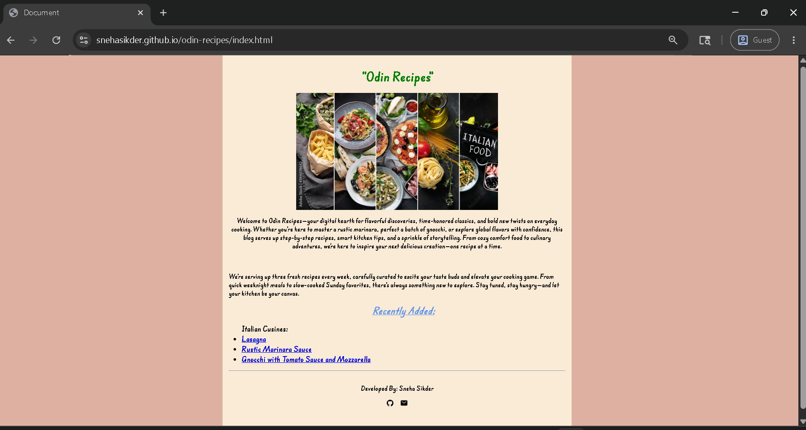
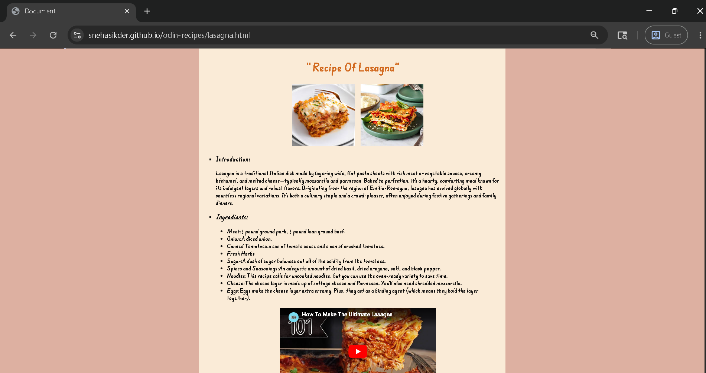
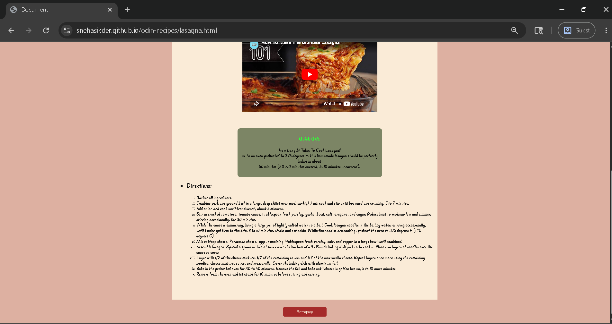
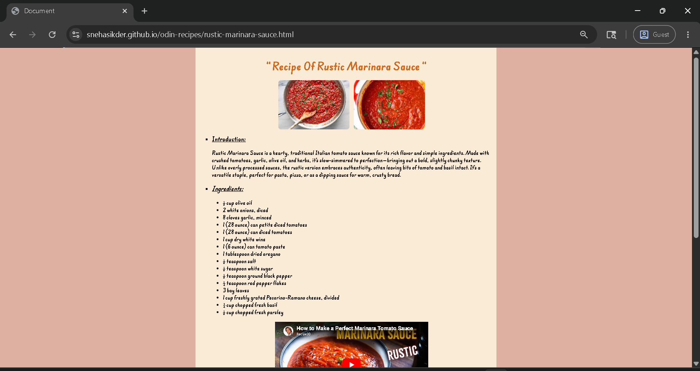
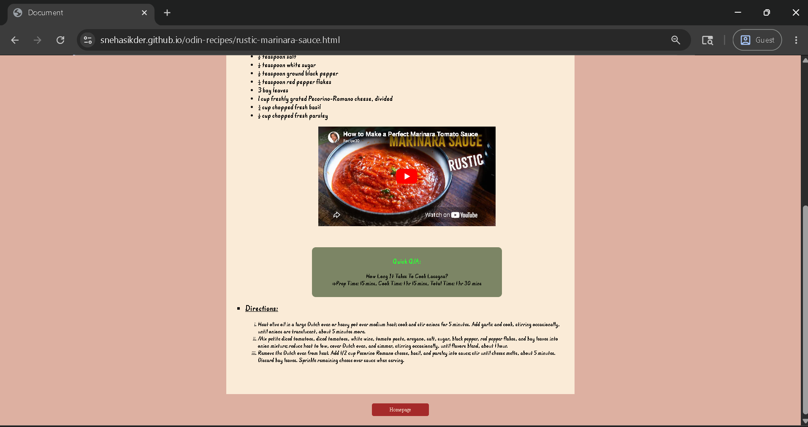
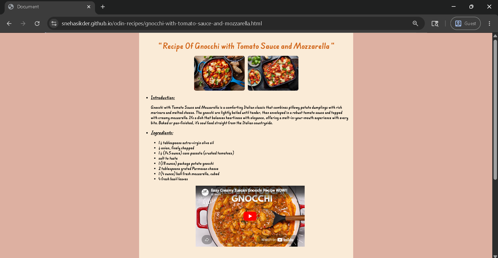
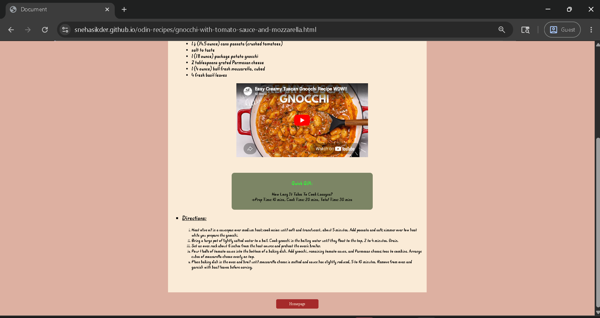

🍽️ Odin Recipes
Welcome to Odin Recipes – a simple, responsive website showcasing delicious recipes, created as part of The Odin Project foundation curriculum. This project demonstrates basic HTML skills and structuring of content for the web.

🌐 Live Site: https://snehasikder.github.io/odin-recipes/
       

📌 Project Overview
The primary objective of this project is to practice and demonstrate:

Structuring HTML documents

Creating internal page navigation via links

Using semantic HTML for clarity and accessibility

Organizing project files and assets in a scalable way

📋 Features
✅ Clean and minimalist layout

✅ Multiple linked recipe pages

✅ Semantic and accessible HTML structure

✅ Easy-to-navigate interface

📄 License
This project is open for educational and non-commercial use. No formal license attached.

